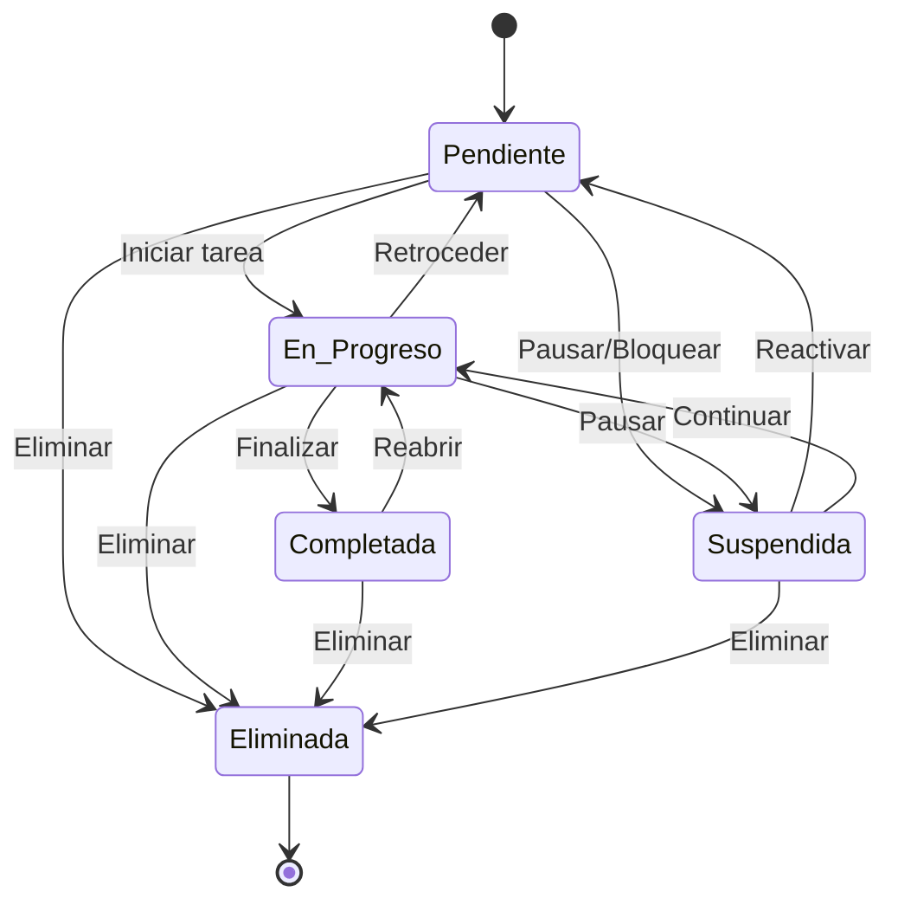
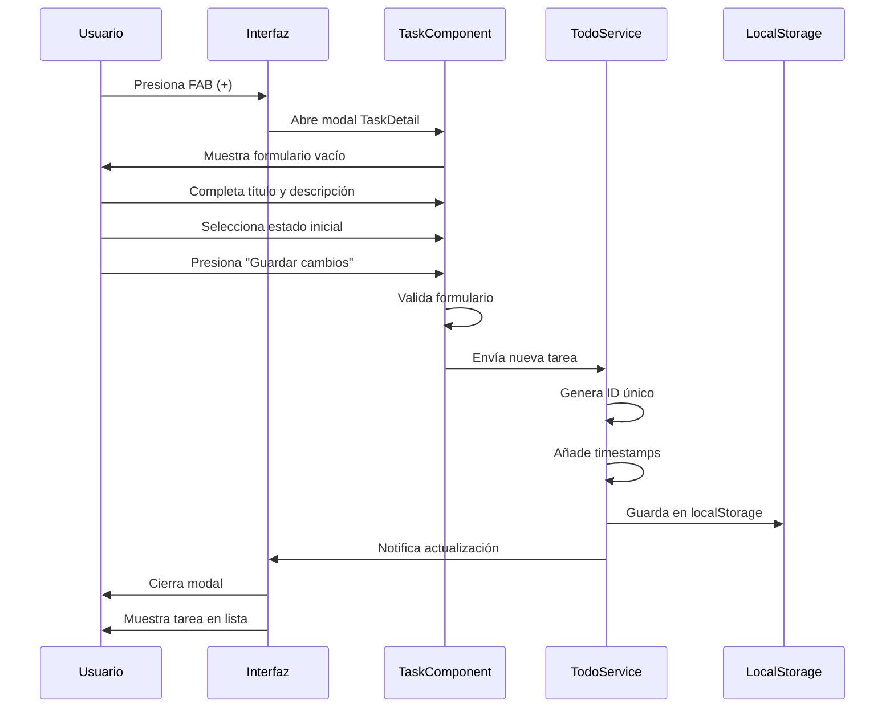
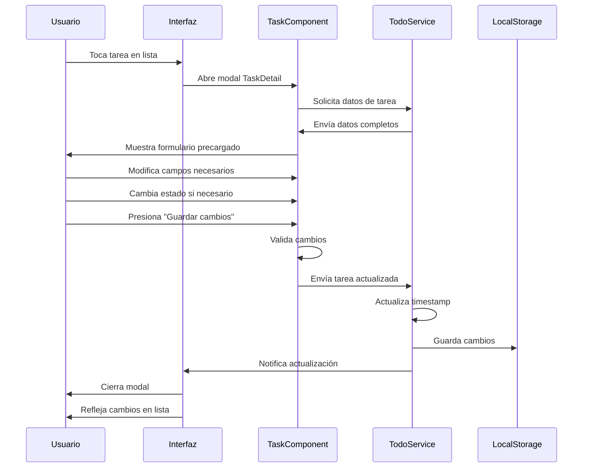
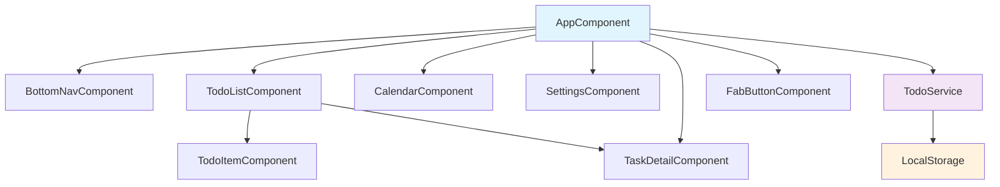

# 📱 Lista de Tareas - App de Gestión de Proyectos

Una aplicación web moderna y responsive para la gestión eficiente de tareas y proyectos, desarrollada con Angular 18 y Material Design.

## 🚀 Características Principales

- **Interfaz Móvil Moderna**: Diseño optimizado para dispositivos móviles con navegación por pestañas
- **Gestión Completa de Tareas**: Crear, editar, eliminar y cambiar estados de tareas
- **Estados Avanzados**: Sistema de estados (Pendiente, En Progreso, Completada, Suspendida, Eliminada)
- **Vista de Calendario**: Organización visual de tareas por fechas
- **Configuración Personalizable**: Temas, notificaciones y opciones de usuario
- **Persistencia Local**: Almacenamiento automático en localStorage
- **Responsive Design**: Funciona perfectamente en móviles, tablets y desktop

## 🎯 Casos de Uso

### 👤 Usuario Principal
**Profesional o estudiante que necesita organizar sus tareas diarias**

#### Casos de Uso Primarios:
1. **Gestionar Tareas Diarias**
   - Crear nuevas tareas con título y descripción detallada
   - Establecer prioridades y fechas de vencimiento
   - Marcar progreso y completar tareas

2. **Seguimiento de Proyectos**
   - Organizar tareas por estados de progreso
   - Visualizar estadísticas de productividad
   - Planificar trabajo futuro

3. **Planificación Temporal**
   - Ver tareas organizadas por calendario
   - Identificar fechas importantes
   - Distribuir carga de trabajo

## 📊 Diagramas de la Aplicación

### 🔄 Diagrama de Estados de Tareas



### 🔄 Diagrama de Secuencia - Crear Nueva Tarea



### 🔄 Diagrama de Secuencia - Editar Tarea Existente



### 🏗️ Diagrama de Arquitectura de Componentes



## 🎮 Guía de Uso

### 📱 Navegación Principal

La aplicación cuenta con **3 pestañas principales** en la navegación inferior:

1. **📋 Tareas**: Vista principal para gestionar todas las tareas
2. **📅 Calendario**: Vista de calendario para planificación temporal
3. **⚙️ Configuración**: Opciones y preferencias de usuario

### ➕ Crear Nueva Tarea

1. **Acceso**: Presiona el botón flotante azul **(+)** en la pestaña de Tareas
2. **Formulario**: Se abre el modal "Detalles de la tarea"
3. **Campos obligatorios**:
   - **Título**: Nombre descriptivo de la tarea
   - **Descripción**: Detalles adicionales (opcional)
   - **Estado**: Selecciona estado inicial (por defecto: Pendiente)
4. **Guardar**: Presiona "Guardar cambios" para crear la tarea

### ✏️ Editar Tarea Existente

1. **Acceso**: Toca cualquier tarea en la lista principal
2. **Modificación**: Edita los campos necesarios en el modal
3. **Estados disponibles**:
   - 🟡 **Pendiente**: Tarea por iniciar
   - 🔵 **En Progreso**: Tarea en desarrollo
   - 🟢 **Completada**: Tarea finalizada
4. **Acciones adicionales**:
   - **Editar tarea**: Modificar después de guardar
   - **Eliminar tarea**: Eliminar permanentemente

### 📊 Visualización de Estados

#### En la Lista Principal:
- **Secciones organizadas** por estado
- **Contadores de tareas** en cada categoría
- **Estadísticas generales** en la parte superior

#### Estados de Tareas:
- **Pendiente por iniciar** 🟡: Tareas nuevas o planificadas
- **En progreso** 🔵: Tareas actualmente en desarrollo
- **Completada** 🟢: Tareas finalizadas exitosamente
- **Suspendida** 🟠: Tareas pausadas temporalmente
- **Eliminada** 🔴: Tareas removidas del sistema

### 📅 Vista de Calendario

- **Navegación mensual** con flechas
- **Indicadores visuales** de tareas por día
- **Filtrado automático** por fecha seleccionada
- **Vista de tareas** del día seleccionado

### ⚙️ Configuración

- **Tema oscuro/claro**: Personalización visual
- **Notificaciones**: Control de alertas
- **Sonidos**: Activar/desactivar audio
- **Perfil de usuario**: Información personal
- **Gestión de datos**: Exportar/importar configuración

## 🔧 Instalación y Desarrollo

### Prerrequisitos
- Node.js (v18 o superior)
- npm (v8 o superior)
- Angular CLI (v18)

### Instalación
```bash
# Clonar repositorio
git clone [repository-url]
cd todo-list-app

# Instalar dependencias
npm install

# Iniciar servidor de desarrollo
npm start
```

### Comandos Disponibles
```bash
# Desarrollo
npm start                 # Servidor de desarrollo (puerto 4200)
npm run build            # Construcción para producción
npm run build:dev        # Construcción para desarrollo

# Testing
npm test                 # Pruebas unitarias
npm run test:watch       # Pruebas en modo observación
npm run e2e              # Pruebas end-to-end

# Análisis
npm run lint             # Verificación de código
npm run analyze          # Análisis de bundle
```

## 🛠️ Tecnologías Utilizadas

- **Framework**: Angular 18
- **UI Library**: Angular Material
- **Styling**: CSS3 + Flexbox/Grid
- **State Management**: RxJS + Services
- **Storage**: localStorage
- **Icons**: Material Icons
- **Testing**: Jest + Angular Testing Library
- **Build Tool**: Angular CLI + Webpack

## 📱 Compatibilidad

- **Navegadores**: Chrome, Firefox, Safari, Edge (últimas 2 versiones)
- **Dispositivos**: Móviles, tablets, desktop
- **Resoluciones**: 320px - 1920px+ (responsive)
- **Sistemas**: Windows, macOS, Linux, iOS, Android

## 🤝 Contribución

1. Fork el proyecto
2. Crea una rama para tu feature (`git checkout -b feature/nueva-funcionalidad`)
3. Commit tus cambios (`git commit -m 'Añade nueva funcionalidad'`)
4. Push a la rama (`git push origin feature/nueva-funcionalidad`)
5. Abre un Pull Request

## 📄 Licencia

Este proyecto está bajo la Licencia MIT - ver el archivo [LICENSE.md](LICENSE.md) para detalles.

## 👨‍💻 Autor

**Yamid Cueto**
- Email: [yamidcuetomazo@gmail.com]
- GitHub: [@YamiCueto](https://github.com/YamiCueto)
- LinkedIn: [Tu perfil de LinkedIn]

---

⭐ Si te gusta este proyecto, ¡dale una estrella en GitHub!

*Desarrollado con ❤️ usando Angular y Material Design*
